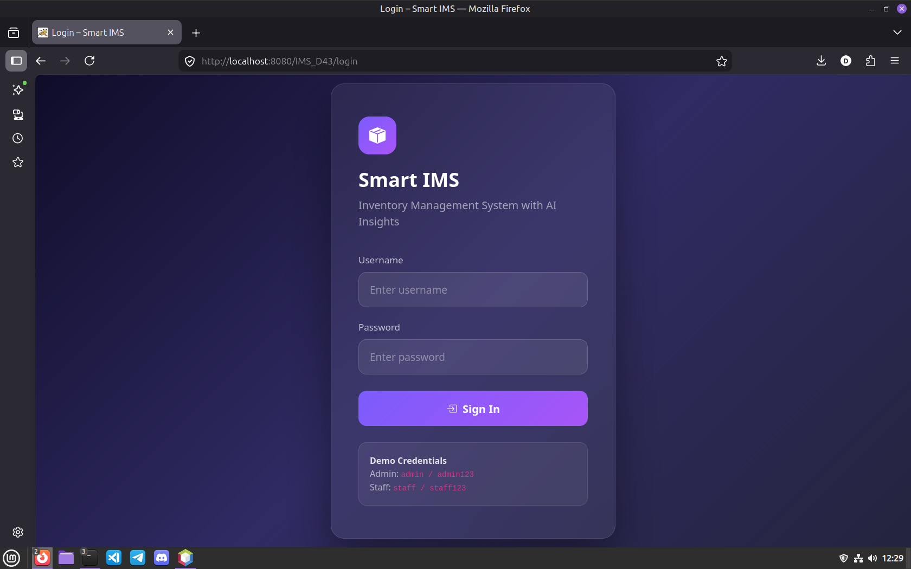
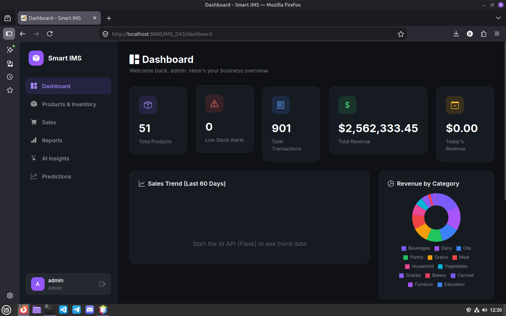
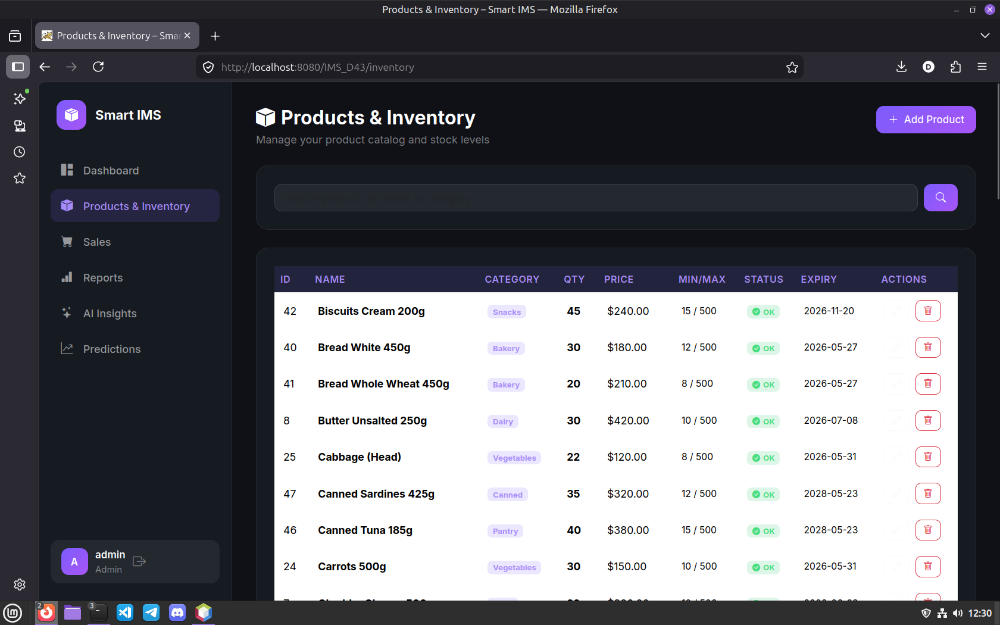
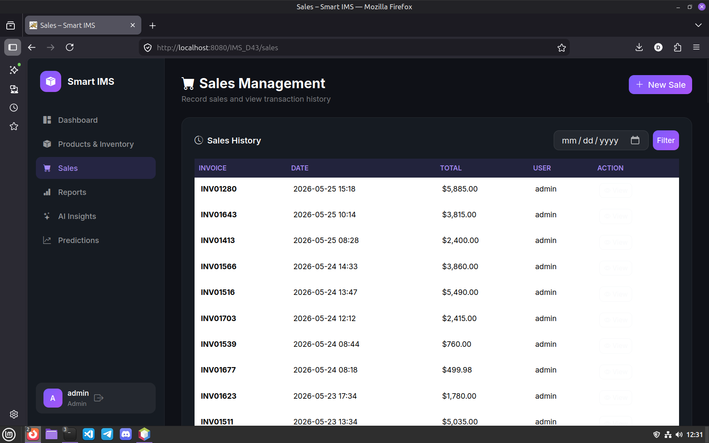
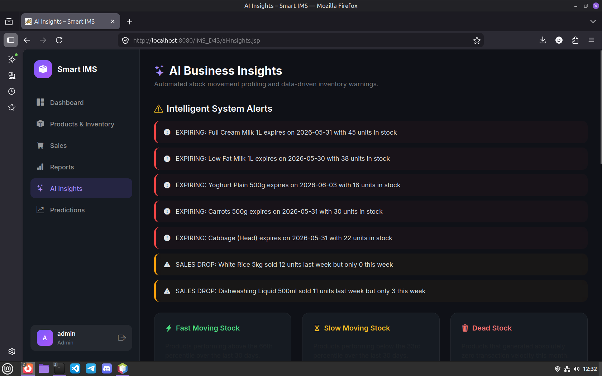

# 🗃️ GenAI-Inventory

> A Smart Inventory Management System built with Java JSP/Servlets and a Python Flask AI microservice, backed by MySQL.


---

## 📌 Project Overview

**GenAI-Inventory** is a full-stack inventory management system developed as a university software engineering project. It combines a Java EE web application with a lightweight Python Flask API to provide both core inventory operations and AI-assisted analytics.

- The **Java web application** (`IMS_D43`) handles all core business logic: authentication, product management, sales recording, and report generation — deployed on Apache Tomcat.
- The **Flask AI microservice** (`ai_api`) exposes REST endpoints that analyse inventory and sales data to generate restocking recommendations and sales trend insights.
- **MySQL** serves as the persistent data store for both layers.

This project was built for academic purposes and demonstrates practical integration of Java EE and Python microservices in a multi-tier architecture.

---

## ✨ Features

### 🔐 Authentication
- User login and session management
- Session-based access control

### 📦 Inventory Management
- Add, update, and remove products
- Real-time stock level tracking
- Low-stock alerts

### 🧾 Sales Management
- Record sales transactions
- Invoice and billing support
- Sales history view

### 📊 Dashboard & Reports
- Sales and inventory summary dashboard
- Visual analytics with Chart.js
- Exportable reports

### 🤖 AI Insights (Flask API)
- Inventory restocking recommendations
- Sales trend analysis
- AI-powered stock movement predictions

---

## 🛠️ Technologies Used

| Technology      | Role                                         |
|-----------------|----------------------------------------------|
| Java (JDK 17+)  | Core backend language                        |
| JSP             | Server-side HTML rendering                   |
| Java Servlets   | Request handling and business logic routing  |
| JDBC            | Java-to-MySQL database connectivity          |
| Apache Tomcat   | Java web application server                  |
| MySQL           | Relational database for all application data |
| Python 3        | AI microservice language                     |
| Flask           | Lightweight REST API framework               |
| Bootstrap       | Responsive frontend UI                       |
| Chart.js        | Dashboard data visualisation                 |

---

## 📂 Project Structure

```
GenAI-Inventory/
├── ai_api/                     # Python Flask AI microservice
│   ├── app.py                  # Flask application entry point and API routes
│   └── requirements.txt        # Python package dependencies
│
├── IMS_D43/                    # Java web application (NetBeans project)
│   ├── src/                    # Java source files
│   │   └── java/
│   │       ├── dao/            # Data Access Objects (database layer)
│   │       ├── model/          # Entity/model classes
│   │       └── servlet/        # Servlet controllers
│   ├── web/                    # Web resources
│   │   ├── WEB-INF/
│   │   │   └── web.xml         # Servlet configuration
│   │   ├── *.jsp               # JSP view pages
│   │   ├── css/                # Stylesheets
│   │   └── js/                 # JavaScript files
│   ├── build.xml               # Ant build file
│   └── nbproject/              # NetBeans project metadata
│
├── generate_sales.py           # Utility script for generating sample sales data
├── inventory_db.sql            # MySQL database schema and seed data
└── README.md
```

---

## ✅ Prerequisites

Make sure the following are installed before setting up the project.

| Requirement        | Version     | Notes                              |
|--------------------|-------------|------------------------------------|
| Java JDK           | 17+         | Required for building and running  |
| Apache Tomcat      | 10+         | Java web application server        |
| MySQL Server       | 8.0+        | Database server                    |
| Python             | 3.10+       | For the Flask AI microservice      |
| Git                | Latest      | Version control                    |
| NetBeans IDE       | 17+         | Recommended Java IDE               |

---

## 🗄️ Database Setup

### 1. Start MySQL and create the database

**Windows (MySQL Shell or Command Prompt):**
```sql
mysql -u root -p
CREATE DATABASE inventory_db;
EXIT;
```

**Linux / macOS:**
```bash
sudo mysql -u root -p
```
```sql
CREATE DATABASE inventory_db;
EXIT;
```

### 2. Import the schema and seed data

**Windows:**
```cmd
mysql -u root -p inventory_db < inventory_db.sql
```

**Linux / macOS:**
```bash
mysql -u root -p inventory_db < inventory_db.sql
```

### 3. Configure the database connection in the Java application

Open `IMS_D43/src/java/dao/DBConnection.java` (or equivalent connection utility) and update the credentials:

```java
private static final String URL      = "jdbc:mysql://localhost:3306/inventory_db";
private static final String USER     = "root";
private static final String PASSWORD = "your_password";
```

### 4. Verify the tables

```sql
USE inventory_db;
SHOW TABLES;
```

---

## 🐍 Python AI API Setup

The `ai_api` folder is located at the **project root**, not inside `IMS_D43`.

It is recommended to use a **virtual environment** to isolate the project's Python dependencies from your system installation. This prevents version conflicts between projects.

### Windows

```cmd
cd ai_api
python -m venv venv
venv\Scripts\activate
pip install -r requirements.txt
python app.py
```

### Linux

```bash
cd ai_api
python3 -m venv venv
source venv/bin/activate
pip install -r requirements.txt
python3 app.py
```

### macOS

```bash
cd ai_api
python3 -m venv venv
source venv/bin/activate
pip install -r requirements.txt
python3 app.py
```

The API will start on `http://localhost:5000` by default.

**To deactivate the virtual environment when finished:**
```bash
deactivate
```

---

## ☕ Java Application Setup

### 1. Open the project in NetBeans
- Launch NetBeans IDE.
- Go to **File → Open Project** and select the `IMS_D43` folder.

### 2. Configure Apache Tomcat
- Go to **Tools → Servers → Add Server**.
- Select **Apache Tomcat** and point it to your Tomcat installation directory.

### 3. Configure database credentials
- Update `DBConnection.java` with your MySQL username and password (see [Database Setup](#-database-setup)).

### 4. Build and Run
- Right-click the project in the Projects panel and select **Clean and Build**.
- Click **Run Project** (or press `F6`).
- Tomcat will start and the application will open in your browser at `http://localhost:8080/IMS_D43/`.

> **Note:** Make sure the Python Flask API is running before accessing any AI Insights features in the application.

---

## 🔑 Default Login Credentials

| Username | Password  |
|----------|-----------|
| `admin`  | `admin123`|

> ⚠️ **Warning:** Change default credentials before deploying to any non-local environment.

---

## 📸 Screenshots

### Login Page


### Dashboard


### Inventory Management


### Sales Page


### AI Insights


> *Screenshots to be added after final deployment.*

---

## 🔒 Security Notes

This is an academic project. Before using in any production or publicly accessible environment:

- Hash passwords using a secure algorithm (e.g., bcrypt) — plain-text password storage is not acceptable in production.
- Use environment variables or a secrets manager for database credentials; never hard-code them.
- Use prepared statements (parameterised queries) throughout the DAO layer to prevent SQL injection.
- Configure HTTPS on Tomcat using a valid SSL certificate.
- Never commit credentials, API keys, or `.env` files to version control.

---

## 🚫 GitHub — What Not to Commit

Make sure your `.gitignore` excludes the following:

```gitignore
# Java build artifacts
build/
dist/
*.class
*.war

# NetBeans private config
nbproject/private/

# Python virtual environment
venv/
__pycache__/
*.pyc

# Environment files
.env
```

These files are either machine-generated, environment-specific, or potentially contain sensitive data.

---

## 🚀 Future Improvements

- **Better AI predictions** — extend the Flask API with more sophisticated forecasting models as more sales data accumulates.
- **Role-based access control** — separate permission levels for admin, manager, and staff users.
- **Report export** — PDF and CSV export for inventory and sales reports.
- **Mobile-friendly UI** — improve Bootstrap layout for tablet and mobile viewports.
- **REST API expansion** — expose inventory endpoints for potential integration with other systems.

---

## 📄 License

This project is licensed under the [MIT License](LICENSE).

---

## 👤 Author

**Dulmina**
Higher National Diploma in Information Technology (NVQ Level 6)
Sri Lanka Institute of Advanced Technological Education (SLAITE)

---

> Built as part of the Enterprise Architecture module — academic year 2024/2025.
